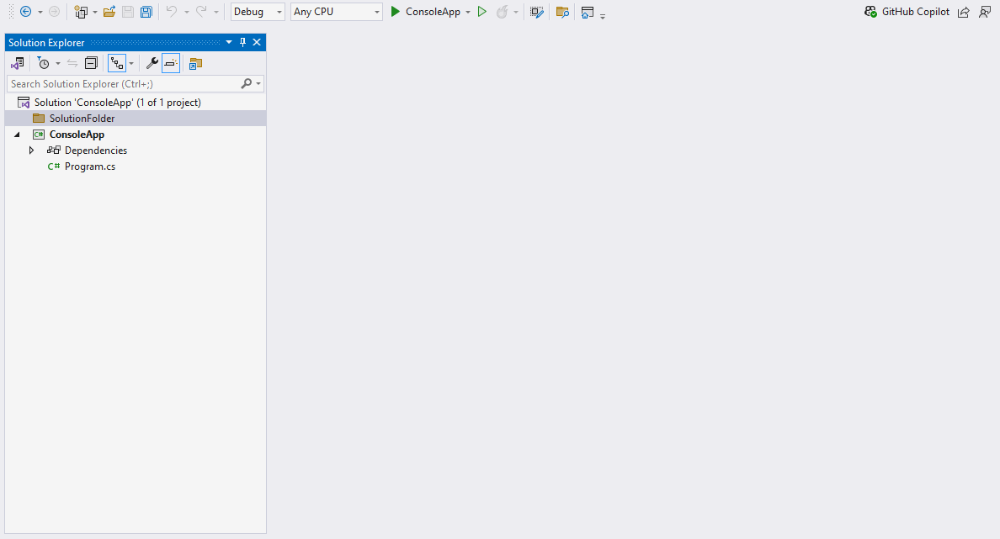

[vsixgallery]: https://www.vsixgallery.com/extension/10bf6342-1b19-4049-a8bf-6d7b763e4f38
[repo]:https://github.com/philiphendry/ExcalidrawInVisualStudio

# Excalidraw in Visual Studio

An unofficial and simple integration of the Excalidraw diagramming tool into Visual Studio. There's a File -> New template
to create Excalidraw diagrams which can be opened form Solution Explorer and edited with the Excalidraw editor
but all from the comfort of Visual Studio.

## 🚀 Features

* Edit `.excalidraw` files in the [Excalidraw editor](https://docs.excalidraw.com) in a Visual Studio tool window.
* Uses an offline version of Excalidraw.
* Excalidraw file templates available in the New File dialog.
* Can save to a file with a `.excalidraw.png` extension with the Excalidraw diagram embedded for extra portability.
* Support light/dark theme adopting the setting from Visual Studio.
* Support libraries allowing you to add to the library and have it persist between sessions.

## 📄 Adding an `.excalidraw` file

## 🖼️ Adding an '.excalidraw.png` file

For extra portability, you can save your Excalidraw diagram as a `.png` file with the Excalidraw diagram embedded.
Although, as this screen animation shows, the file extension is messed up a little by the extension and needs manual intervention at the moment ☹️.

